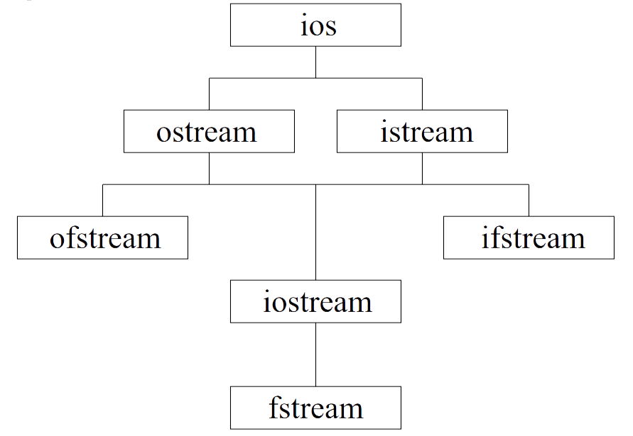

<style>
   em{
        font-style: normal;
        font-weight: bold;
        color: purple;
   }
</style>

<!-- _class: lead -->
# **输入输出流概述**

---

### **标准库概述**

+ C++语言软件库提供了很多预先编制并经过测试的代码，这就是C++的标准库。
+ C++标准库是用C++语言编写的类和函数库，支持大多数程序设计所涉及的常规功能。其他程序设计语言中作为固有内容的许多特性，在C++中都是由类或函数来完成的。
+ 例如，基本的输入输出、数据转换、字符串操作和输出格式化等，标准C++类和函数都支持，但它们并不是C++的语言特性。

---

### **标准库概述**

+ 标准库通常是由编译器厂商提供，但它与操作系统平台、厂商和编译器版本无关，因此，使用C++标准库编写的C++程序，可以在任意的操作系统平台（DOS、Windows、Linux等）下使用任意的支持标准C++的编译器编译、运行。
+ C++的标准库中包含常量、变量、函数、类等，主要有标准函数库和标准类库。
+ 标准函数库是从C语言中继承下来的，其中包含C格式的输入输出函数、字符与字符串处理函数、数学函数、时间日期函数、动态分配函数以及一些实用函数等；

---

### **标准库概述**
+ 标准类库中则包含有标准C++的I/O流类、字符串类、数字类、异常处理和杂项类以及STL容器类等。
+ 为了使用由C++提供的标准库函数或类，必须包含相应的头文件，这样，标准库提供的函数和类就可以像自己文件中定义的函数和类一样使用。

---

### **头文件**
C++的头文件有三种来源：
1. 标准C语言库函数的头文件，如<string.h>、<ctype.h>和<stdlib.h>等，它们带有.h后缀；
2. 标准C++语言类库的头文件，如<iostream>、<string>和<vector>等，它们不带.h后缀；
3. 由标准C语言库函数头文件变成的标准C++的头文件，如<cstring>、<cctype>和<cstdlib>等，它们把原有标准C语言库函数头文件去掉.h后缀而加上c前缀。

---

### **流**

+ C++语言没有把输入/输出操作当作语言的内在组成部分。C语言依赖于函数库，用输入输出函数来扩展语言；与此类似，C++依赖输入/输出类库来扩展语言。
+ C++的输入/输出是以字节流的形式实现的，流实际上就是一个字节序列。在输入操作中，字节从输入设备（如键盘、磁盘、网络连接等）流向内存；
+ 在输出操作中，字节从内存流向输出设备（如显示器、打印机、磁盘、网络连接等）。

---

### **流**

+ 输入/输出系统的任务实际上就是以一种稳定、可靠的方式在设备与内存之间传输数据，应用程序把字节的含义与字节关联起来，字节可以是ASCII字符、内部格式的原始数据、图形图像、数字音频、数字视频或其他任何应用程序所需要的信息。
+ C++的输入/输出功能都是面向对象的，有两组类提供了两个级别的I/O功能。一组从streambuf派生而来，提供基本的低级输入/输出操作，并对整个C++的I/O系统提供底层支持。
+ 低级I/O通常只在设备和内存之间传输一些字节，是无格式的I/O，使用起来不太方便，但能提供大容量、高速度的传输；

---

### **流**
+ 另一组类从ios派生而来，可以提供格式化、错误检查和状态信息，是高级的I/O。
+ 高级的I/O把若干个字节组成有意义的单位，如整数、浮点数、字符、字符串以及用户自定义的数据类型，各种I/O操作都是以对数据类型敏感的方式来执行的，如果函数被设计成处理某种特定的数据类型，而实际的数据类型与函数不匹配，就会产生编译错误，因此，C++使用的是类型安全（type safe）的I/O操作（C语言则不然）。
+ 除了基本的输入/输出流外，文件和字符串也可以看成有序的字节流，使用ios派生的类进行处理，分别称为文件流和字符串流。

---

### **输入输出流**

C++的iostream类库提供了数百种I/O功能，iostream类库的接口部分分别包含在几个头文件中。
+ 头文件iostream包含了操作所有输入/输出流所需的基本信息，因此大多数C++程序都应该包含这个头文件。
+ 头文件iostream中含有4个对象：cin、cout、cerr、clog，对应于标准输入流、标准输出流、非缓冲和经缓冲的标准错误流。该头文件提供了无格式I/O功能和格式化I/O功能。

---

### **输入输出流**

+ 在执行格式化I/O时，如果流中带有含参数的流操纵符，需包含头文件iomanip。
+ 头文件fstream包含由用户控制的文件处理操作的信息，在文件处理程序中将使用这个头文件。

---

### **输入/输出流类和对象**

+ iostream类库包含了许多用于处理大量I/O操作的类，其中，类istream支持流输入操作，类ostream支持流输出操作，类iostream同时支持流输入和输出操作。
+ 类istream和类ostream是通过单一继承从基类ios派生而来的。类iostream是通过多重继承从类istream和ostream派生而来的。

---

### **继承关系图**



---

### **主要的类**

1. **`ios` 类**：是输入输出流类的基类，它提供了一些基本的流状态信息和格式控制功能。
2. **`istream` 类**：继承自 `ios`，是输入流的基类，用于从输入设备（如键盘、文件、字符串）读取数据。
3. **`ostream` 类**：同样继承自 `ios`，是输出流的基类，用于向输出设备（如屏幕、文件、字符串）写入数据。
4. **`ifstream` 类**：继承自 `istream`，专门用于从文件中读取数据。
5. **`ofstream` 类**：继承自 `ostream`，专门用于向文件中写入数据。

---

### **主要的类**

6. **`iostream`类**： 同时继承自 `istream` 和 `ostream`，它既可以进行字符串的输入操作，也可以进行字符串的输出操作。
7. **`fstream` 类**：继承自 `iostream`，用于对文件进行读写操作，兼具 `ifstream` 和 `ofstream` 的功能。

这些类之间的继承关系使得它们可以共享一些通用的功能和接口，同时又各自提供了针对不同输入输出场景的特定功能。 

---

### 1. 标准输入输出流类（`<iostream>`）
- `iostream`是一个复合类，它同时继承自 `istream` 和 `ostream`，具备输入和输出的功能。不过在实际使用中，通常不会直接使用`iostream`，而是使用它的具体派生类或对象。
- `istream` 类是输入流的基类，主要用于从输入设备（如键盘）读取数据。它提供了一系列的输入操作符和成员函数，像 `>>` 操作符用于从流中提取数据，`get()` 函数用于读取单个字符等。
- `ostream` 类是输出流的基类，主要用于向输出设备（如屏幕）输出数据。它提供了 `<<` 操作符用于向流中插入数据，还有 `put()` 函数用于输出单个字符等。

---

### **iostream的常用对象**

- **`std::cin`**：它是 `istream` 类的一个对象，代表标准输入流，通常与键盘关联，用于从键盘读取用户输入的数据。
- **`std::cout`**：它是 `ostream` 类的一个对象，代表标准输出流，通常与屏幕关联，用于向屏幕输出数据。
- **`std::cerr`**：同样是 `ostream` 类的对象，代表标准错误输出流，用于输出错误信息，它是无缓冲的，即输出的信息会立即显示。
- **`std::clog`**：也是 `ostream` 类的对象，用于输出日志信息，它是有缓冲的。

---

### **iostream的常用对象**

+ 一个C++程序开始运行时将自动打开4个内置的标准流对象：cin、cout、cerr和clog。
+ 重载的左移位运算符（<<）表示流的输出，称为流插入运算符；重载的右移位运算符（>>）表示流的输入，称为流读取运算符。
+ 这两个运算符可以和标准流对象以及用户自定义的流对象一起使用，实现C++的基本输入输出。

---

### **iostream的常用对象**
+ 流读取运算符完全能够识别所处理数据的类型。假设已经正确地声明了a的类型，那么没有必要为指明数据类型而给流读取运算符添加类型信息。
+ 流插入运算符完全能够识别变量a的数据类型，假定已经正确地声明了该变量，那么没有必要再为指明数据类型而给流插入运算符添加类型信息。

---

### **C++标准输入输出流的重定向**

在 C++ 里，标准输入流 `std::cin` 通常关联着键盘，标准输出流 `std::cout` 一般关联着屏幕，标准错误流 `std::cerr` 和 `std::clog` 也默认输出到屏幕。不过，有时你可能需要把输入输出的目标进行改变，也就是将输入源从键盘改成文件，或者把输出目的地从屏幕改成文件，这就是标准输入输出流的重定向。

---

### **重定向的方法**
#### 使用 `freopen` 函数
`freopen` 是 C 标准库中的一个函数，在 `<cstdio>` 头文件中声明，它能重新打开一个已存在的流，进而实现输入输出流的重定向。

---

#### *函数原型*
```cpp
FILE* freopen(const char* filename, const char* mode, FILE* stream);
```
- `filename`：要打开的文件名。
- `mode`：文件的打开模式，例如 `"r"` 表示只读，`"w"` 表示只写，`"a"` 表示追加等。
- `stream`：要重定向的流，常见的有 `stdin`（标准输入）、`stdout`（标准输出）、`stderr`（标准错误输出）。

如果文件打开成功，返回指向该文件的 `FILE` 指针；若失败，则返回 `NULL`。

---

### **示例代码**
```cpp
int main() {
    // 重定向标准输入到文件 input.txt
    if (freopen("input.txt", "r", stdin) == NULL)
        return 1;
        // 重定向标准输出到文件 output.txt
    if (freopen("output.txt", "w", stdout) == NULL)
        return 1;
    int num;
    std::cin >> num;  // 从 input.txt 中读取数据
    std::cout << "读取的数字是: " << num << std::endl;  // 将结果输出到 output.txt
    // 恢复标准输入输出
    freopen("/dev/tty", "r", stdin);
    freopen("/dev/tty", "w", stdout);
    return 0;
}
```

---

### **代码解释**

- **重定向输入**：`freopen("input.txt", "r", stdin)` 把标准输入流 `stdin` 重定向到 `input.txt` 文件，这样 `std::cin` 就会从这个文件读取数据。
- **重定向输出**：`freopen("output.txt", "w", stdout)` 把标准输出流 `stdout` 重定向到 `output.txt` 文件，所以 `std::cout` 的输出内容会被写入该文件。
- **恢复默认**：`freopen("/dev/tty", "r", stdin)` 和 `freopen("/dev/tty", "w", stdout)` 在 Linux 或 macOS 系统下能将输入输出流恢复到默认的终端设备。在 Windows 系统中，可以使用 `freopen("CON", "r", stdin)` 和 `freopen("CON", "w", stdout)` 来恢复。

---

#### 使用 C++ 流对象的 `rdbuf` 成员函数
除了 `freopen` 函数，C++ 还可以通过流对象的 `rdbuf` 成员函数来实现重定向。
#### 示例代码
---

```cpp
int main() {
    std::ifstream inFile("input.txt");
    std::ofstream outFile("output.txt");
    // 保存原始的输入输出缓冲区
    std::streambuf* cinBuf = std::cin.rdbuf();
    std::streambuf* coutBuf = std::cout.rdbuf();
    // 重定向输入输出
    std::cin.rdbuf(inFile.rdbuf());
    std::cout.rdbuf(outFile.rdbuf());
    int num;
    std::cin >> num;
    std::cout << "读取的数字是: " << num << std::endl;
    // 恢复原始的输入输出缓冲区
    std::cin.rdbuf(cinBuf);
    std::cout.rdbuf(coutBuf);
    inFile.close();
    outFile.close();
    return 0;
}
```

---

### **代码解释**
- **保存原始缓冲区**：`std::cin.rdbuf()` 和 `std::cout.rdbuf()` 分别获取 `std::cin` 和 `std::cout` 的原始缓冲区指针并保存。
- **重定向操作**：`std::cin.rdbuf(inFile.rdbuf())` 和 `std::cout.rdbuf(outFile.rdbuf())` 把 `std::cin` 和 `std::cout` 的缓冲区替换为文件流的缓冲区，从而实现重定向。
- **恢复缓冲区**：最后将原始缓冲区指针重新设置回去，恢复默认的输入输出。 
