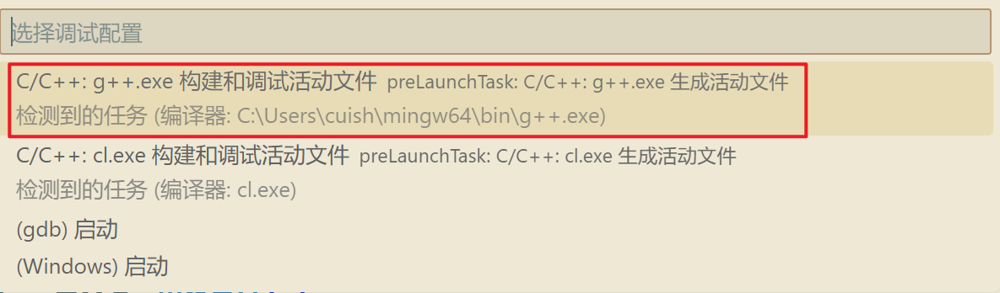

<!-- _class: lead -->
# **环境准备**

---

### 本书样例代码及课件下载网址：
https://github.com/ShuningCui/CPPLearn

#### 注意：
本书课件以markdown格式的文件组织，要渲染为PPT的样式，请在vscode中安装"marp for VS Code"扩展。访问marp官网：https://marp.app 获得更多信息

---

### 1. **安装VS Code**

从[VS Code官网](https://code.visualstudio.com/)下载适合你操作系统的安装包，然后按照安装向导完成安装。

---

### 2. **安装C++编译器**
- **Windows系统**：
    - 安装MinGW-w64。从github下载[MinGW-w64](https://github.com/niXman/mingw-builds-binaries/releases)，下载适合你系统的安装包。安装完成后，<font color=purple>需将MinGW-w64的`bin`目录添加到系统的环境变量`PATH`中</font>。
    - 验证安装是否成功，打开命令提示符，输入`g++ --version`，若能显示版本信息，则表示安装成功。
    - 或者安装微软的c++编译器，[Microsoft Build Tools](https://visualstudio.microsoft.com/visual-cpp-build-tools/)

---

### 2. **安装C++编译器**
- **Windows系统**：
- MinGW-w64
- https://github.com/niXman/mingw-builds-binaries/releases


---

### 2. **安装C++编译器**
- **Windows系统**：
- Microsoft Build Tools
- https://visualstudio.microsoft.com/visual-cpp-build-tools/


---

### 2. **安装C++编译器**
- **macOS系统**：
    - 可以使用Xcode Command Line Tools。打开终端，输入`xcode-select --install`，按照提示完成安装。
  
- **Linux系统**：
    - 以Ubuntu为例，打开终端，输入`sudo apt-get update`更新软件源，然后输入`sudo apt-get install g++`安装GCC编译器。

安装完成后，在终端输入`g++ --version`，若显示版本信息，则安装成功。

---

### 3. **安装VS Code的C++扩展**

- 打开VS Code，点击左侧的扩展图标（四个方块组成的图标）。
- 在搜索框中输入“C++”，选择“C/C++”扩展并点击安装。该扩展提供了语法高亮、代码补全、调试等功能。


---

### 4. **配置VS Code的C++环境**

- 打开VS Code，创建或打开一个C++文件。
- 按下`Ctrl + Shift + P`（Windows/Linux）或`Cmd + Shift + P`（macOS），输入“Tasks: Configure Default Build Task”，选择“前面安装的编译器编译”。
- 这会在项目的`.vscode`文件夹下生成`tasks.json`文件（一般不用更改）
- 按下`Ctrl + Shift + D`（Windows/Linux）或`Cmd + Shift + D`（macOS）打开调试视图，点击齿轮图标，选择“C++ (GDB/LLDB)”。
- 这会在`.vscode`文件夹下生成`launch.json`文件

---

### 5. 测试环境
- 创建一个简单的C++文件，例如`test.cpp`，
```cpp
#include <iostream>

int main() {
    std::cout << "Hello, World!" << std::endl;
    return 0;
}
```
按下右上角的运行按钮，查看运行结果。

---

### 6. 运行c++程序

